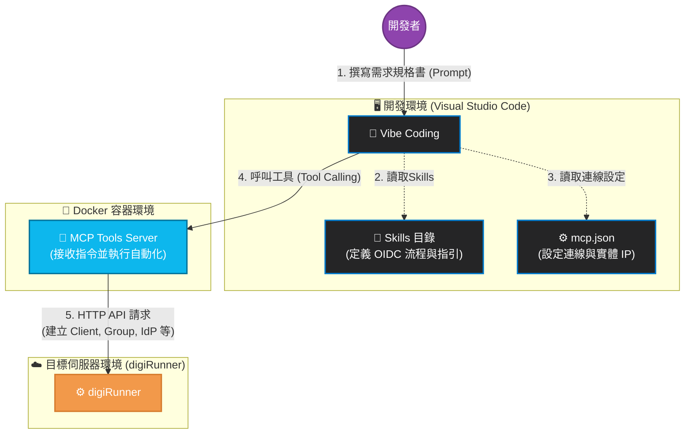

# digiAI Studio：引領 Vibe Coding 的企業級 AI 開發環境

## digiAI Studio 是什麼？

**digiAI Studio：引領 Vibe Coding 新世代的企業級 AI 開發環境**

digiAI Studio 是一個專為現代軟體工程打造的「AI 賦能開發與整合環境」。它打破了傳統繁瑣的程式碼撰寫模式，讓開發者與企業團隊能夠以 **Vibe Coding（直覺式／自然語言驅動開發）** 的全新體驗，輕鬆建構高度複雜的企業級應用系統。

透過深度整合 AI 能力與專業的 API 管理底層，開發者只需專注於高階的商業邏輯與系統架構，將繁複的 API 串接、配置與基礎程式碼生成交由 AI 輔助完成。這不僅大幅縮短了產品上市時間（Time-to-Market），更能確保所開發出的系統具備企業級所要求的安全性、高可用性與擴充彈性。

## digiAI Studio 有什麼？

**三大核心組件，無縫串聯「開發、管理與自動化」的生態系**

digiAI Studio 的環境主要由以下三大核心支柱構成，為開發者提供一站式的極速開發體驗：

* **核心中樞：digiRunner (企業級 APIM 平台)**
  作為整個 Studio 的運行基石，digiRunner 提供強大且穩健的 API 管理能力。無論是 API 閘道路由、安全認證、流量控管或生命週期管理，都能確保透過 AI 開發出來的微服務與應用程式，直接擁有符合企業標準的 API 基礎架構。

* **智能開發介面：Vibe Coding 專屬 IDE**
  一個專為 AI 協作與 Vibe Coding 量身打造的整合開發環境（IDE）。開發者可以在此環境中透過自然對話、提示詞（Prompt）與直覺化的操作，與 AI 進行結對編程（Pair Programming），享受行雲流水般的開發節奏。

* **AI 溝通橋樑：digiRunner MCP Tools / Skills**
  這是 digiAI Studio **最核心的技術亮點**。透過獨家開發的 Model Context Protocol (MCP) 伺服器與專屬 Skills，我們賦予了 AI 模型「直接理解並操作 digiRunner」的能力。
  這意味著開發者在 IDE 中透過 AI 寫程式時，AI 可以自動調用這些 MCP 工具，無縫完成 APIM 上的環境設定、API 規格生成、甚至進行端點測試與除錯。徹底打破「寫程式」與「平台管理」的界線，實現真正的自動化開發閉環。

## digiAI Studio 架構與運作流程



## 安裝指南

透過以下步驟，您可以在 Visual Studio Code 中，利用 Docker 快速啟動 digiRunner 的 **MCP Tools Server**，並讓專案內的 **Skills** 能夠順利呼叫與使用該伺服器提供的功能。

---

### 步驟一：環境準備 (Prerequisites)

在開始之前，請確保您的作業系統已安裝以下必備工具：
1. **Visual Studio Code**: 作為您檢視專案與執行指令的主要環境。
2. **Git**: 用於從 GitHub 複製專案原始碼。
3. **Docker**: 必須安裝並啟動 Docker 引擎（例如 Docker Desktop），此為運行 MCP Tools Server 的必備環境。

---

### 步驟二：從 GitHub 取得專案 

1. 開啟 Visual Studio Code。
2. 呼叫出內建的終端機 (Terminal)：可使用快捷鍵 `` Ctrl + ` `` 或從上方選單選擇 `Terminal > New Terminal`。
3. 在終端機中輸入以下指令，將 GitHub 上的專案複製到本地端：

```bash
# 複製 GitHub 專案至本地端 (請將 URL 替換為您的實際網址)
git clone https://github.com/tpisoftware-hub/digiAI-Studio.git

# 進入專案目錄
cd digiAI-Studio

```

**📂 專案架構說明：**
進入目錄後，您會看到兩個核心部分：
* `docker-compose.yml`：用來建立並啟動 **MCP Tools Server** 的 Docker 配置檔。
* `Skills/` 目錄：這是一個存放技能定義與腳本的目錄。**這些 Skills 會作為客戶端或觸發者，負責去呼叫並使用 MCP Tools Server 所提供的工具服務。**

### 步驟三：digiRunner安裝方式

[參考文件](https://github.com/TPIsoftwareOSPO/digiRunner-Open-Source)

## Skills 清單與作用說明

以下是使用到的 Skills 總覽，分為主流程、平台設定與程式碼實作三個階段：

### 🌟 主流程嚮導

| Skill 名稱 | 作用 |
| :--- | :--- |
| **`digirunner-oidc-flow-guide`** | **總嚮導**：自動引導完成 OIDC 登入流程的平台設定與程式碼產生 |

---

### ⚙️ 第一階段：平台設定 (MCP Tools)
主要用於在 digiRunner 平台上建立必要的環境與設定。

| Skill 名稱 | 作用 |
| :--- | :--- |
| `digiRunner-configureStaticWebReverseProxy` | 設定前端網頁的反向代理 (Reverse Proxy) 路徑 |
| `digiRunner-searchClient` | 查詢指定的 Client ID 是否存在 |
| `digiRunner-createClient` | 建立新的用戶端 (Client) |
| `digiRunner-updateClientTokenSettings` | 設定 Token 規則與登入後的回傳網址 (Redirect URI) |
| `digiRunner-searchGroup` | 查詢指定的權限群組是否存在 |
| `digiRunner-createGroup` | 建立新的權限群組 (Group) |
| `digiRunner-associateClientGroup` | 將用戶端 (Client) 綁定至指定群組 |
| `digiRunner-testJdbcConnection` | 測試使用者資料庫 (JDBC) 連線是否成功 |
| `digiRunner-createJdbcConnection` | 建立並儲存資料庫連線設定 |
| `digiRunner-createGtwJdbcIdp` | 建立身分驗證資料來源 (IdP)，對應資料庫的帳號/密碼/Email |

---

### 💻 第二階段：程式碼實作 (Sub-skills)
主要用於幫開發者自動寫好各種 OIDC 流程的程式碼。

| Skill 名稱 | 作用 |
| :--- | :--- |
| `digiRunner-oidc-auth-request` | 實作**請求授權**：產生登入 URL、State 與 PKCE 驗證碼 |
| `digiRunner-oidc-auth-callback` | 實作**接收回傳**：建立處理 Redirect URI 的端點 |
| `digiRunner-oidc-token-exchange` | 實作**換取 Token**：用授權碼向伺服器換取 Access/ID Token |
| `digiRunner-oidc-token-verify` | 實作**驗證身分**：解析 ID Token 並取得使用者資訊 |
| `digiRunner-oidc-token-refresh` | 實作**刷新 Token**：Access Token 過期時自動換發新 Token |
| `digiRunner-oidc-token-revocation` | 實作**登出撤銷**：登出時註銷 Access 與 Refresh Token |

---

### 🔧 其他輔助 Skills

| Skill 名稱 | 作用 |
| :--- | :--- |
| `digirunner-api-setup` | 用於在 digiRunner 上註冊與新增 API |
| `digiRunner-oidc-api-call` | 實作帶有 Token 的 API 呼叫（如 Axios 攔截器） |

## Skills 使用指南 (以 Visual Studio Code 為例)

在 Visual Studio Code 中搭配 Vibe Coding (AI 輔助開發) 時，請依照以下標準流程啟動服務、配置連線設定，並透過正確的規格書提示詞 (Prompt) 來觸發 digiRunner 的專屬 Skills。

### 🚀 執行流程

#### 第一步：啟動 digiRunner

在開始撰寫程式碼或呼叫 AI 之前，請確保您的 **digiRunner (APIM 平台)** 伺服器已經成功啟動並正常運行，以便後續的 API 管理與身分驗證服務能夠順利連線。

#### 第二步：啟動 MCP Tools Server

在 VS Code 的終端機中，進入您的 MCP 專案目錄，並透過 Docker 啟動底層的工具伺服器：

```bash
docker compose up -d
```

確認容器狀態為運行中 (`Up`) 後，伺服器即準備好接收請求。

#### 第三步：配置 MCP 連線設定 (`mcp.json`)

為了讓 VS Code 與 MCP Tools Server 溝通，您必須在 MCP 設定檔（通常為 `mcp.json` 或對應的設定介面）中加入以下連線配置：

```json
{
    "servers": {
        "digiRunner": {
            "type": "http",
            "url": "http://192.168.30.124:8081/mcp",
            "headers": {
                "digiRunnerEndpoint": "https://192.168.30.124:18080",
                "username": "manager",
                "password": "manager123"
            }
        }
    },
    "inputs": []
}
```

⚠️ **重要 IP 設定規範 (必讀)**：

> * **`url`**：為 MCP Tool Server 的主機位置，**絕對不可使用 `127.0.0.1` 或 `localhost`**。請務必填寫開發機的實體 IP（例如：`192.168.30.124`）。
> * **`digiRunnerEndpoint`**：為 digiRunner 平台的主機位置，**同樣不可使用 `127.0.0.1` 或 `localhost`**。請填寫實際的網路 IP 或網域，以確保環境間能正確連線。
> * **`username`**：digiRunner 平台的登入帳號。
> * **`password`**：digiRunner 平台的登入密碼。

---

#### 第四步：將 Skills 放置於專案目錄

為了讓 Visual Studio Code 中的 AI 能夠成功讀取並使用這些預先定義好的Skills，您必須將 Skills 檔案放置到專案的特定目錄下。

請在您當前開發的專案根目錄中，建立 `.github/skills` 資料夾，並將所有 digiRunner 相關的 Skills 檔案（例如 `digirunner-oidc-flow-guide` 及其 sub-skills）放入該目錄中。如此一來，AI 才能在對話中正確載入並觸發它們。

---

#### 第五步：撰寫規格書以觸發 Skills

當服務啟動、配置完成，且 Skills 已放入正確目錄後，您可以在 VS Code 的 AI 對話框中，貼上您的「需求規格書」。

為了讓 AI 能夠精準辨識並自動觸發相關的設定與程式碼產出，**在您的規格書或提示詞 (Prompt) 中，必須包含以下三個重點**：

1. **OIDC**：必須明確指出「**使用 digiRunner 的 OIDC 做身分驗證**」。
2. **OIDC 身分驗證資料來源**：必須提供具體的資料庫連線資訊，讓 AI 知道去哪裡驗證帳號密碼。例如：
   `jdbc:h2:tcp://localhost:9092/./ai-marketplace;USER=admin;PASSWORD=123456`
3. **使用 Skill**：**`必須`** 明確指示 AI「**使用 `digirunner-` 開頭的 skill 進行實作**」。

---

## 💡 規格書 (Prompt) 撰寫範例

您可以直接複製以下範例，修改後貼給 VS Code 中的 AI 助手：

> **【系統開發需求規格書】**
> 
> 請幫我開發一個會員登入模組，具體規格如下：
> 
> * **身分驗證機制**：請使用 digiRunner 的 OIDC 做身分驗證。
> * **OIDC 身分驗證資料來源**：請使用以下資料庫連線資訊建立 JDBC IdP 設定：
>   `jdbc:h2:tcp://localhost:9092/./ai-marketplace;USER=admin;PASSWORD=123456`
> * **開發規範**：請**`必須`**使用 `digirunner-` 開頭的 skill 進行實作，完成平台設定與前端登入程式碼。
> 
> 請開始執行，若有需要我提供的參數 (如網域、Client ID 等) 請隨時詢問我。

當 AI 讀取到上述規格書後，就會自動識別關鍵字，並觸發 `digirunner-oidc-flow-guide` 總嚮導，開始一步步引導您完成所有設定與程式碼開發！
